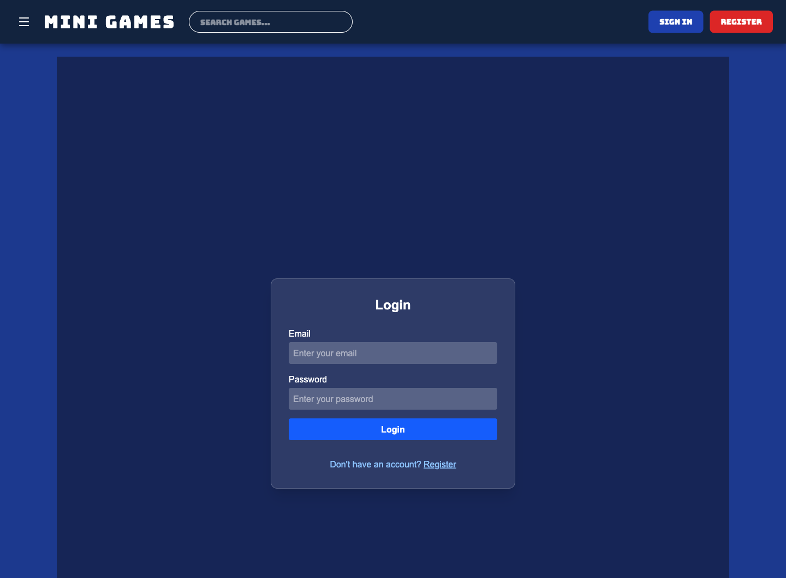
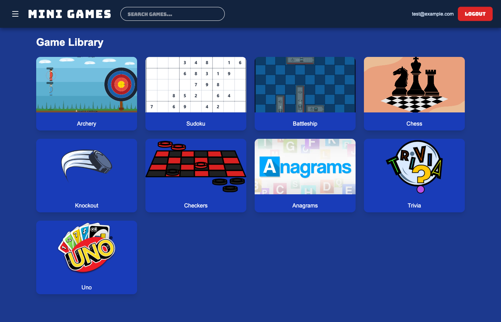
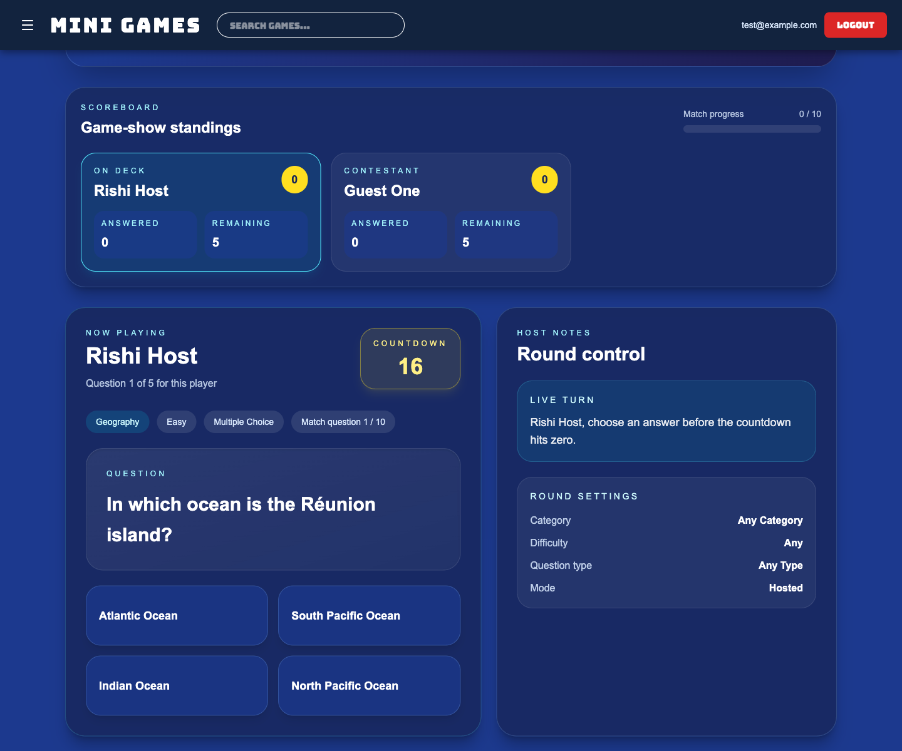

# Mini-Game Platform [](https://github.com/cmpe195-group1/minigame-platform/actions/workflows/ci.yml) [](https://codecov.io/github/cmpe195-group1/minigame-platform)

> A full-stack browser mini-game platform for quick singleplayer and multiplayer sessions with friends.

## Team 34

| Name        | GitHub                                       | Email                  |
|:------------|----------------------------------------------|------------------------|
| Huy Mai     | [@huynai](https://github.com/huynai)         | huy.mai@sjsu.edu       |
| Richard Ngo | [@rng04](https://github.com/rng04)           | richard.t.ngo@sjsu.edu |
| Rishi Raja  | [@airsquared](https://github.com/airsquared) | rishi.raja01@sjsu.edu  |

**Advisor:** Wencen Wu

---

## Problem Statement

When you want to play games with your friends, it’s hard to quickly find a game to get started and get everyone playing together.

## Solution

A web platform that hosts a library of lightweight browser games. The platform allows singleplayer and multiplayer. 
The games are designed to be easy to pick up and play, with simple controls and a fast learning curve. The platform also includes features for inviting friends and creating game rooms.

### Key Features

- Firebase-backed sign in and registration with backend JWT sync
- React + Vite frontend with protected routes for the game library
- Spring Boot backend with PostgreSQL persistence
- STOMP/WebSocket multiplayer infrastructure on `/ws`
- Lightweight browser games with both local and hosted multiplayer flows

Included games:
- Trivia
- Uno
- Anagrams
- Knockout
- Chess
- Checkers
- Battleship
- Sudoku
- Archery

---

## Demo

**Live Demo:** https://minigames.up.railway.app

**Trivia Game walkthrough video:** [`docs/screenshots/trivia-hosted-game.mp4`](docs/screenshots/trivia-hosted-game.mp4)

---

## Screenshots

| Screen              | Preview                                                         |
|---------------------|-----------------------------------------------------------------|
| Login page          |                   |
| Game library        |               |
| Hosted Trivia match |  |

---

## Tech Stack

| Category    | Technology                                          |
|-------------|-----------------------------------------------------|
| Frontend    | React 19 + TypeScript + Vite 8                      |
| Game Engine | Phaser                                              |
| Backend     | Spring Boot 4 + Java 25                             |
| Database    | PostgreSQL                                          |
| Auth        | Firebase Auth + Spring Security JWT resource server |
| Multiplayer | STOMP over WebSocket                                |
| Deployment  | Railway                                             |

---

## Getting Started

### Prerequisites

- Java 25
- Node.js 25.4
- PostgreSQL (or adjust `DB_URL` to use a hosted PostgreSQL instance)

### Installation

```bash
# Clone the repository
git clone https://github.com/SJSU-CMPE-195/group-project-team-34
cd group-project-team-34

# Install frontend dependencies
cd frontend
npm install

# Install backend dependencies
# Only requires Java 25, no additional setup needed
```

### Running Locally

```bash
# Start the backend server (adjust DB env vars as needed)
export DB_URL=jdbc:postgresql://localhost:5432/minigame
export DB_USERNAME=postgres
export DB_PASSWORD=password
./gradlew bootRun

# Start the frontend development server
export VITE_BACKEND_URL=http://localhost:8080
cd frontend
npm run dev
```

The frontend expects `VITE_BACKEND_URL` and defaults to the deployed backend host logic in `frontend/src/backend.ts`. During Gradle frontend builds, the backend URL is set to `http://localhost:8080`.

### Running Tests [](https://codecov.io/github/cmpe195-group1/minigame-platform)

```bash
./gradlew test # Run backend tests
./gradlew testE2E # Run end-to-end tests with frontend. Note: will rebuild the frontend with VITE_BACKEND_URL=http://localhost:8080 before running.
./gradlew check # Run all tests in one go
```

### Building for Production

```bash
# Build backend JAR
./gradlew bootJar

# Build frontend static assets
export VITE_BACKEND_URL=http://... # backend URL for production, can be http://localhost:8080 for local testing
cd frontend
npm run build
```
Locate the executable JAR in `build/libs/` and the frontend build output in `frontend/dist/` for deployment.

---

## API Reference

<details>
<summary>Click to expand API endpoints</summary>

| Method | Endpoint       | Auth         | Description                                              |
|--------|----------------|--------------|----------------------------------------------------------|
| GET    | `/`            | No           | Returns the API welcome message from `PublicController`. |
| GET    | `/ping`        | No           | Returns request diagnostics and a `Pong` response.       |
| GET    | `/auth/signin` | Bearer token | Creates the user row if it does not already exist.       |
| GET    | `/auth/test`   | Bearer token | Echoes the authenticated user id and JWT token value.    |

### WebSocket / Multiplayer

| Type           | Endpoint / Prefix | Notes                                         |
|----------------|-------------------|-----------------------------------------------|
| STOMP endpoint | `/ws`             | Registered in `MultiplayerWebSocketConfig`.   |
| App prefix     | `/app/**`         | Client sends multiplayer commands here.       |
| Topic prefix   | `/topic/**`       | Client subscribes here for room/game updates. |

Examples in the backend include routes like `/app/archery/create`, `/app/archery/join`, `/app/anagrams/create`, and matching `/topic/...` subscriptions used by frontend multiplayer clients.

### API Notes

- **Security:** `SecurityConfiguration` currently requires JWT auth only for `/auth/**`; all other HTTP routes are anonymous.
- **Interactive docs:** With Springdoc available at runtime (for example via `./gradlew bootRun`), docs are typically served at:
  - `/v3/api-docs`
  - `/swagger-ui/index.html`

- **CORS:** allowed origins include localhost, `127.0.0.1`, and the deployed Railway frontend.

</details>

---

## Frontend Routes

Public routes:

| Route       | Component      |
|-------------|----------------|
| `/login`    | `LoginPage`    |
| `/register` | `RegisterPage` |

Authenticated routes:

| Route               | Component               |
|---------------------|-------------------------|
| `/`                 | `CardGrid` game library |
| `/games/sudoku`     | `SudokuPage`            |
| `/games/archery`    | `ArcheryPage`           |
| `/games/battleship` | `BattleshipPage`        |
| `/games/chess`      | `ChessPage`             |
| `/games/knockout`   | `KnockoutGameWrapper`   |
| `/games/checkers`   | `CheckersPage`          |
| `/games/trivia`     | `Trivia`                |
| `/games/anagrams`   | `Anagrams`              |
| `/games/uno`        | `Uno`                   |

Any unmatched route redirects back to `/` after authentication.

### Authentication Flow

- Frontend auth state is managed in [`frontend/src/auth.ts`](frontend/src/auth.ts) with Firebase Auth local persistence.
- After email/password sign in or sign up, the frontend sends the Firebase ID token to [`/auth/signin`](#api-reference) through [`frontend/src/backend.ts`](frontend/src/backend.ts).
- Protected frontend routes are gated by `RequireAuth` in [`frontend/src/main.tsx`](frontend/src/main.tsx).

---

## Project Structure

```
.
├── build.gradle
├── docs/
│   └── screenshots/
├── src/
│   ├── main/
│   │   ├── java/cmpe195/group1/minigameplatform/
│   │   │   ├── db/
│   │   │   ├── games/
│   │   │   ├── multiplayer/
│   │   │   └── rest/
│   │   └── resources/
│   └── test/
│       └── java/cmpe195/group1/minigameplatform/
│           ├── e2e/
│           ├── integration/
│           ├── games/
│           ├── multiplayer/
│           └── rest/
└── frontend/
    ├── package.json
    ├── public/game-thumbnails/
    └── src/
        ├── auth.ts
        ├── backend.ts
        ├── main.tsx
        ├── components/
        ├── games/
        ├── multiplayer/
        └── pages/
```

### Notable Source Areas

- `src/main/java/.../rest/`: public and authenticated HTTP controllers
- `src/main/java/.../multiplayer/`: shared room and WebSocket/STOMP infrastructure
- `src/main/java/.../games/*/`: per-game services, payloads, and WebSocket controllers
- `src/test/java/.../e2e/`: end-to-end tests with frontend interaction using Playwright
- `src/test/java/.../integration/`: integration tests for backend services and controllers
- `frontend/src/components/`: shared UI such as the page header and card grid
- `frontend/src/games/`: game implementations and multiplayer client logic
- `frontend/src/pages/`: route-level wrappers for game screens

---

## License

This project is licensed under the MIT License - see the [LICENSE](LICENSE) file for details.

---

*CMPE 195A/B - Senior Design Project | San Jose State University | Spring 2026*
